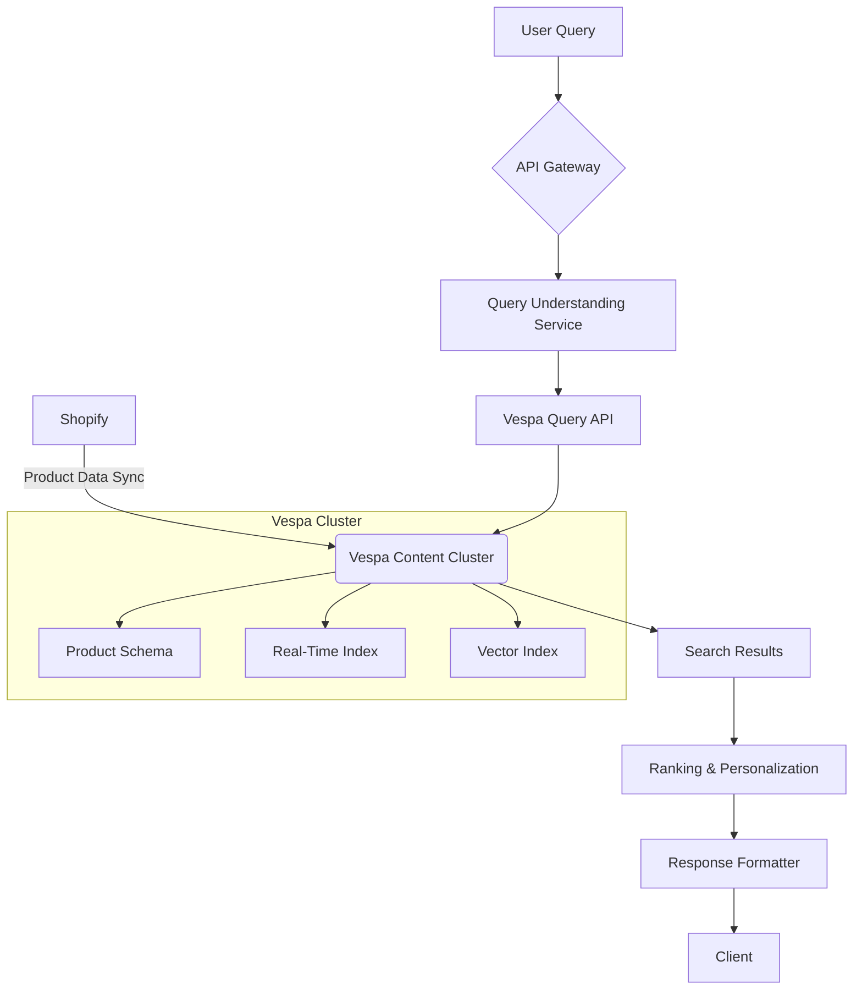

# Perplexity-Style Shopping Backend Architecture  

**Version**: 1.2  
**Date**: 2024-02-04  
**Primary Components**: Search Engine, Product Catalog, Ranking System  

---

## 1. Core Architecture Diagram  



---

## 2. Data Ingestion Pipeline  

### 2.1 Shopify Integration  

**API Endpoints**:  

```bash
GET /admin/api/2024-01/products.json # Product metadata
GET /admin/api/2024-01/inventory_levels.json # Real-time stock
```

**Data Sync Flow**:  

1. **Initial Full Sync**:  

   ```python
   def full_sync():
       products = paginate_shopify_api('/products', params={
           'fields': 'id,title,variants,inventory_quantity',
           'limit': 250
       })
       vespa_batch_upsert(transform(products))
   ```

2. **Delta Updates**:  

   ```python
   shopify_webhook('products/update', lambda event: 
       vespa_update_doc(
           id=event['id'],
           fields={'inventory': event['inventory_quantity']}
       )
   )
   ```

**Data Transformation**:  

```json
{
  "vespa_fields": {
    "product_id": "shopify_123",
    "title": "DEWALT 20V Drill",
    "category": ["tools", "power-tools"],
    "price": 179.99,
    "in_stock": true,
    "embedding": [0.23, -0.45, ..., 0.78] // 384d
  }
}
```

---

## 3. Vespa Schema Design  

### 3.1 Product Schema (product.sd)  

```schema
schema product {
  document product {
    field product_id type string {
      indexing: summary | attribute
      attribute: fast-search
    }
    
    field title type string {
      indexing: index | summary
      index: enable-bm25
    }
    
    field embedding type tensor<float>(x[384]) {
      indexing: attribute | index
      attribute {
        distance-metric: angular
      }
      index {
        hnsw {
          max-links-per-node: 16
          neighbors-to-explore-at-insert: 200
        }
      }
    }
    
    field price type float {
      indexing: attribute
      attribute: fast-access
    }
  }
  
  fieldset default {
    fields: title, description
  }
}
```

### 3.2 Ranking Profiles  

**Hybrid Search Profile**:  

```rank-profile hybrid {
  first-phase {
    expression: nativeRank(title) + closeness(field, embedding)
  }
  
  second-phase {
    expression {
      (0.6 * firstPhase) + 
      (0.3 * freshness(timestamp)) + 
      (0.1 * log(price))
    }
    rerank-count: 100
  }
}
```

**Personalized Ranking**:  

```rank-profile personalized {
  function user_affinity() {
    expression: sum(query(user_views) * attribute(item_views))
  }
  
  first-phase {
    expression: hybrid + 0.5 * user_affinity
  }
}
```

---

## 4. Query Processing  

### 4.1 Query Understanding Flow  

1. **Input**: "cordless drill under $150 with lithium battery"  
2. **NLP Processing** (BERT-based):  

   ```json
   {
     "intent": "product_search",
     "filters": {
       "price": {"max": 150},
       "attributes": ["cordless", "lithium"]
     },
     "vector_query": [0.45, -0.32, ...] // 384d embedding
   }
   ```

3. **Vespa YQL Translation**:  

   ```yaml
   yql: |
     select * from product where 
     ({targetHits: 100}nearestNeighbor(embedding, query_embedding)) 
     and price < 150 
     and title contains "cordless" 
     and description contains "lithium"
   ranking: hybrid
   ```

---

## 5. Performance Targets  

### 5.1 Search Performance  

| Metric                  | Target      | Vespa Configuration             |
|-------------------------|-------------|----------------------------------|
| P95 Latency             | < 120ms     | 3-node cluster, NVMe SSDs        |
| Index Freshness         | < 1s        | Real-time writes enabled         |
| Query Throughput         | 8k QPS      | Load-balanced content nodes      |
| Recall@100              | > 92%       | HNSW ef=300, post-filtering      |

### 5.2 Resource Allocation  

```yaml
content {
  tuning {
    search {
      max-hits-per-node: 1000
      query-timeout: 500ms
    }
  }
  proton {
    flush-on-shutdown: true
    allocation {
      searchable-copies: 2
    }
  }
}
```

---

## 6. Security Design  

### 6.1 Data Protection  

- **In Transit**: TLS 1.3 for all API calls  
- **At Rest**: AES-256 encryption for document stores  
- **API Security**:  

  ```bash
  # Vespa request authentication
  curl -H "Authorization: Bearer $(vespa auth token)" \
       -H "Content-Type: application/json" \
       "https://vespa-endpoint/search/"
  ```

---

## 7. Monitoring & Logging  

### 7.1 Key Metrics  

```prometheus
# Prometheus Metrics
vespa_content_proton_documentdb_ready_documents{documenttype="product"}
vespa_content_proton_documentdb_total_document_size{documenttype="product"}
vespa_container_http_request_hits{path="/search/*"}
```

### 7.2 Alert Thresholds  

```yaml
alert: HighQueryLatency
expr: vespa_container_http_request_latency_seconds:99quantile > 0.2
for: 5m
labels:
  severity: critical
annotations:
  summary: "Query latency exceeded 200ms P99"
```

---

## 8. Deployment Architecture  

### 8.1 Cluster Layout  

```text
AWS us-east-1
├── Content Node (r6i.4xlarge)
│   ├── 16 vCPU
│   ├── 128GB RAM
│   └── 2TB NVMe
├── Container Node (c6i.8xlarge)
│   ├── 32 vCPU 
│   └── 64GB RAM
└── Admin Node (t3.large)
```

### 8.2 High Availability  

- **Multi-AZ Deployment**: 3 availability zones  
- **Disaster Recovery**: Hourly snapshots to S3  
- **Auto-scaling**: Content nodes scale at 70% CPU  

---

## 9. Implementation Roadmap  

| Phase | Timeline | Deliverables | Success Metrics |
|-------|----------|--------------|------------------|
| 1     | 2 weeks  | Core Vespa cluster setup<br>Basic product schema | 95% uptime SLA |
| 2     | 3 weeks  | Shopify sync pipeline<br>Hybrid ranking | <500ms p95 latency |
| 3     | 2 weeks  | Personalization layer<br>Monitoring dashboards | 10% CTR improvement |
| 4     | Ongoing  | Query understanding model<br>A/B testing | 15% conversion lift |

---

This design document provides all necessary components to implement a production-ready search backend comparable to Perplexity's shopping feature. The Vespa-centric architecture ensures real-time performance while maintaining flexibility for future enhancements.
