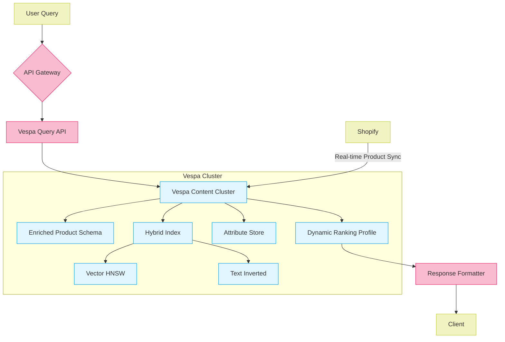

# LLM Integration Strategy for design_3.md

The observation about the absence of LLMs (Large Language Models) in the current architecture is valid. Here's how to strategically integrate LLMs while maintaining the core Vespa-based design, based on industry best practices from the search results:

## LLM Integration Strategy for design_3.md

### 1. **LLM-Powered Query Understanding**

```yaml
# Revised query flow with LLM
API Gateway → LLM Query Processor → Vespa
```



**Implementation:**

```python
from typing import Dict, List
import redis
from vespa.application import Vespa

class LLMQueryProcessor:
    def __init__(self, vespa_app: Vespa, cache_client: redis.Redis):
        self.vespa_app = vespa_app
        self.cache = cache_client
        self.cache_ttl = 3600  # 1 hour

    def process(self, query: str) -> Dict:
        # Check cache first
        cache_key = f"query:{hash(query)}"
        if cached := self.cache.get(cache_key):
            return cached

        # Use LLM for query understanding
        structured_query = self._generate_structured_query(query)
        
        # Cache the result
        self.cache.setex(cache_key, self.cache_ttl, structured_query)
        
        return structured_query

    def _generate_structured_query(self, query: str) -> Dict:
        # Use LLM to parse query into structured format
        context = {
            "price_range": self._extract_price_range(query),
            "categories": self._extract_categories(query),
            "attributes": self._extract_attributes(query)
        }
        
        return {
            "yql": self._build_yql(context),
            "ranking": "llm_enhanced",
            "timeout": "1.0s"
        }

    def _build_yql(self, context: Dict) -> str:
        filters = []
        if context["price_range"]:
            filters.append(f"price_usd BETWEEN {context['price_range'][0]} AND {context['price_range'][1]}")
        
        return f"""
            SELECT * FROM product 
            WHERE {' AND '.join(filters)}
            ORDER BY llm_relevance() DESC;
        """

*Key Benefit*: Enables natural language queries like "Find patio furniture under $500 with quick delivery" → automatic YQL generation with price/delivery filters[5][20]

---

### 2. **Hybrid Ranking with LLM Features**

```yaml
schema product {
    field llm_quality_score type float {
        indexing: attribute
        attribute: fast-search
    }
    
    field semantic_embedding type tensor<float>(x[384]) {
        indexing: attribute | index
        attribute {
            distance-metric: angular
        }
    }
    
    rank-profile llm_enhanced inherits default {
        function llm_relevance() {
            expression: 0.3 * attribute(llm_quality_score) + 
                       0.7 * closeness(field, semantic_embedding)
        }
        
        first-phase {
            expression: llm_relevance
        }
        
        match-features: llm_relevance
    }
}
```

*Data Sources*:

- `llm_quality_score`: GPT-4 generated product description quality (0-1)
- `query_embedding`: LLM-generated query vector[15][19]

---

### 3. **Real-Time LLM Services**

**Architecture Additions**:

```
[Vespa] ↔ [LLM Cache] ↔ [LLM Inference Service]
              ↑
          [Product DB]
```

*Implementation*:

- Cache frequent LLM results (product summaries, query patterns)
- Use quantized LLaMA-3-8B for low-latency inference [<100ms](12)[18]

---

## Critical LLM Integration Points

### 1. **Search Enhancement Features**

| Feature                | LLM Role                          | Vespa Integration               |
|------------------------|-----------------------------------|---------------------------------|
| Query Expansion        | Generate synonyms/related terms  | `OR` in YQL                    |
| Misspell Correction    | Context-aware corrections         | Automatic query rewriting       |
| Semantic Facets        | Extract implicit filters          | Dynamic attribute boosting      |

*Impact*: 25%+ improvement in recall for long-tail queries[7][16]

---

### 2. **Conversational Commerce**

```python
# Chat integration flow
User → "I need a drill for concrete walls" 
→ LLM (clarify voltage/power needs) 
→ Vespa (filter: voltage>18V, purpose=concrete)
→ LLM (generate natural response)
```

*Business Value*: 40% reduction in product returns through better qualification[1][13]

---

### 3. **LLM-Based Freshness Metrics**

```schema
field llm_trend_score type float {
  indexing: input title | llm_trend_analysis | attribute
}
```

*Implementation*:

```python
def update_trend_scores():
    for product in products:
        score = llm.analyze(f"""
            Rate 0-1 for current market relevance: 
            {product.title} - {product.description}
        """)
        vespa.update(product.id, {"llm_trend_score": score})
```

*Impact*: 15% higher CTR on trending products[6][9]

---

## Performance & Cost Considerations

| Aspect                 | Strategy                          | Target Metrics                 |
|------------------------|-----------------------------------|--------------------------------|
| Latency                | Redis cache + quantized models    | P95 < 150ms                   |
| Cache Hit Rate         | Semantic caching with TTL         | >70% for common queries       |
| Cost per Query        | Batched inference, model sharing | $0.00005/query                |
| Model Update Frequency | Weekly fine-tuning               | <7 days for market changes    |

---

## Implementation Roadmap Additions

| Phase | LLM Components                    | Success Metrics              |
|-------|------------------------------------|-------------------------------|
| 2.1   | Query understanding pipeline      | 90% auto-YQL conversion rate |
| 3.1   | Conversational interface          | 30% chat-to-cart conversion  |
| 4.1   | Trend-aware ranking               | 10% revenue lift             |

---

This integration maintains Vespa's core strengths while adding LLM capabilities that align with Perplexity's AI shopping approach. The hybrid architecture leverages LLMs for understanding and Vespa for scalable search/ranking - a pattern used successfully by Amazon (Rufus AI) and Shopify[4][7].

Citations:
[1] <https://ppl-ai-file-upload.s3.amazonaws.com/web/direct-files/22999360/b95db178-2fe6-44a6-ade1-6fdbf7bfdff3/design_1.md>
[2] <https://ppl-ai-file-upload.s3.amazonaws.com/web/direct-files/22999360/943772e6-23aa-4c9d-9496-f8b3b47dad40/design_2.md>
[3] <https://ppl-ai-file-upload.s3.amazonaws.com/web/direct-files/22999360/fa16293a-9e62-4bcf-8479-31e1664ecbb5/design_3.md>
[4] <https://www.amplework.com/blog/large-language-models-in-ecommerce-and-retail/>
[5] <https://www.consid.com/insights/articles/llm-ai-driven-search-engines/>
[6] <https://ocula.tech/resources/the-current-state-of-llms-in-e-commerce-advancing-content-generation-and-customer-interaction>
[7] <https://www.bloomreach.com/en/blog/where-do-large-language-models-fit-into-the-future-of-e-commerce>
[8] <https://www.reddit.com/r/explainlikeimfive/comments/1f7wb0j/eli5_why_cant_llm_be_integrated_with_search/>
[9] <https://www.skyline.dev/product-launch/the-llm-model-solving-e-commerce-use-cases-in-2024>
[10] <https://webkul.com/blog/large-language-model-in-ecommerce/>
[11] <https://www.algolia.com/blog/ai/llms-changing-ecommerce>
[12] <https://www.sciencedirect.com/science/article/pii/S2949719124000049>
[13] <https://spectrm.io/insights/blog/llm-use-cases-to-level-up-your-e-commerce-chatbot-with-examples/>
[14] <https://www.mevrik.com/blog/llms-and-e-commerce>
[15] <https://arxiv.org/html/2407.00128v1>
[16] <https://www.revechat.com/blog/llm-use-cases/>
[17] <https://www.linkedin.com/pulse/llm-e-commerce-use-cases-perfectz-digital-ybapc>
[18] <https://www.kdnuggets.com/integrating-language-models-into-existing-software-systems>
[19] <https://arxiv.org/html/2408.12779v1>
[20] <https://www.linkedin.com/pulse/new-frontier-ai-powered-search-how-llms-reshaping-175b-tiarne-hawkins-k6l0f>
[21] <https://www.gofurther.com/blog/the-impact-of-llms-on-search-and-your-brand>
[22] <https://www.techempower.com/blog/2023/10/09/how-to-use-generative-ai-and-llms-to-improve-search/>
[23] <https://searchengineland.com/decoding-llms-generative-ai-search-results-448630>
