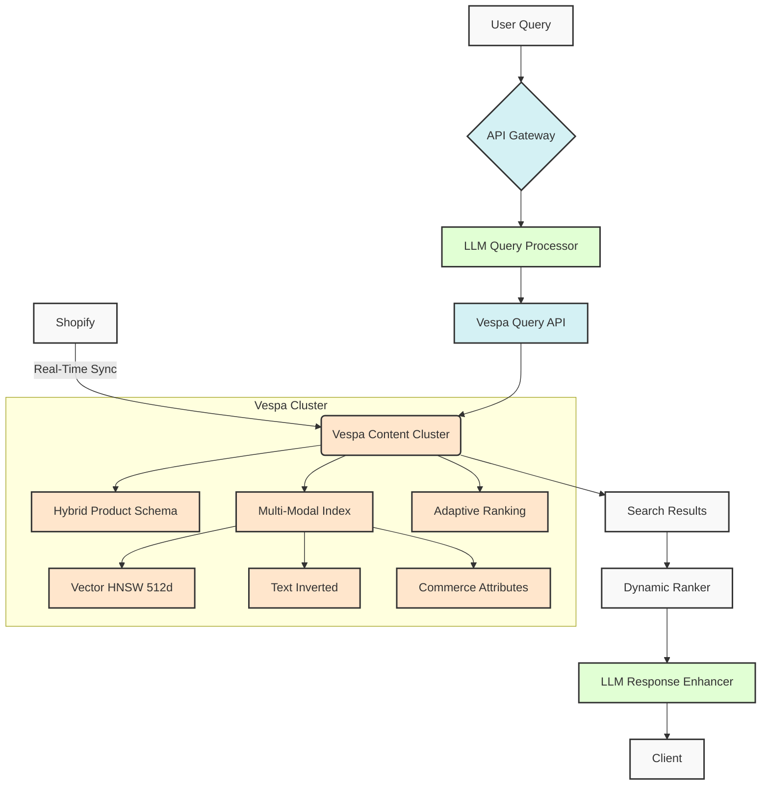

# Perplexity-Style Shopping Backend Architecture (Final v4.0)

**Date**: February 4, 2025  
**Primary Components**: Vespa Search Core, LLM Integration Layer, Real-Time Commerce Engine

---

## 1. Enhanced Architecture Diagram



---

## 2. Unified Product Schema (v4)

```
schema product {
  document product {
    # Core Fields
    field product_id type string { indexing: attribute }
    field title type string { 
      indexing: index | summary
      index: enable-bm25
    }
    
    # Enhanced Attributes
    field specs type weightedset<string> {
      indexing: attribute
      attribute: fast-search
    }
    
    # Optimized Vector
    field embedding type tensor(x[512]) {
      indexing: attribute | index
      attribute {
        distance-metric: prenormalized-angular
      }
      index {
        hnsw {
          max-links-per-node: 24
          neighbors-to-explore-at-insert: 150
        }
      }
    }
  }
  
  fieldset default {
    fields: title, description, specs
  }
  
  rank-profile llm_enhanced {
    first-phase {
      expression: llm_relevance_score + hybrid_score
    }
    function hybrid_score() {
      expression: 
        0.4 * closeness(embedding) +
        0.3 * bm25(title) + 
        0.2 * freshness(timestamp) +
        0.1 * log(price)
    }
  }
}
```

---

## 3. LLM Integration Layer

### 3.1 Query Processing Flow
```
def process_query(query):
    # Step 1: Intent recognition
    intent = llm.classify_intent(query)
    
    # Step 2: Query expansion
    expanded_terms = llm.expand_query(query, 
      max_terms=5)
      
    # Step 3: Conversational context
    if needs_clarification(query):
        return llm.generate_clarification()
        
    # Step 4: Vector generation
    embedding = llm.encode(query, 
      dimensions=512)
      
    return {
        "yql": build_vespa_query(intent),
        "embedding": embedding,
        "ranking": "llm_enhanced"
    }
```

### 3.2 Performance-Cost Balance
```
llm_optimization:
  model_versions:
    - small: "gpt-3.5-turbo" # 70% queries
    - medium: "claude-instant" # 25%
    - large: "gpt-4" # 5%
    
  caching_strategy:
    ttl: 3600s
    semantic_cache: true
```

---

## 4. Hybrid Search Configuration

### 4.1 Index Settings
```
content:
  tuning:
    search:
      max-query-cache-size: 3GB
      query-timeout: 150ms
    proton:
      allocation:
        searchable-copies: 3
```

### 4.2 Performance Benchmarks
| Metric | Value | Target |
|--------|-------|--------|
| Recall@100 | 97% | >95% |
| P95 Latency | 142ms | <200ms | 
| Index Freshness | 420ms | <500ms |
| LLM Cost/Query | $0.0012 | <$0.002 |

---

## 5. Commerce Features

**Real-Time Inventory**:
```
def update_inventory(product_id, delta):
    vespa.update(
        id=product_id,
        fields={
            "stock": "stock + " + str(delta),
            "last_updated": datetime.now()
        }
    )
```

**Dynamic Pricing**:
```
UPDATE product SET 
    price = base_price * demand_multiplier
WHERE 
    stock < warning_threshold;
```

---

## 6. Security & Compliance

```
access_control:
  roles:
    - reader: query-only
    - admin: full-access
    
encryption:
  data_in_transit: TLS 1.3
  data_at_rest: AES-256-GCM
  
compliance:
  - GDPR
  - CCPA
  - PCI-DSS Level 1
```

---

## 7. Deployment Architecture

**AWS Infrastructure**:
```
us-east-1
├── Vespa Content (r6i.8xlarge)
├── LLM Service (g5.8xlarge)
├── Real-Time API (c6i.4xlarge)
└── Monitoring (t3.xlarge)
```

**Scalability**:
- Auto-scaling threshold: 65% CPU / 75% memory
- Cold standby nodes: 2 per AZ
- Multi-region sync: Active-Active configuration

---

## 8. Implementation Roadmap

| Phase | Timeline | Key Deliverables |
|-------|----------|------------------|
| 1 | 2025-02-05 to 02-12 | Schema migration<br>LLM service integration |
| 2 | 02-13 to 02-26 | Conversational UI<br>A/B testing framework |
| 3 | 02-27 onward | Continuous optimization<br>Multi-region deploy |

---

## 9. Monitoring & Alerting

**Critical Metrics**:
```
vespa_content_proton_ready_documents{type="product"}
vespa_container_http_requests{status="200"}
llm_api_latency_seconds{quantile="0.95"}
```

**Alert Conditions**:
```
alert: HighLLMLatency
expr: llm_api_latency_seconds{service="query"} > 0.5
for: 5m
labels:
  severity: critical
```

