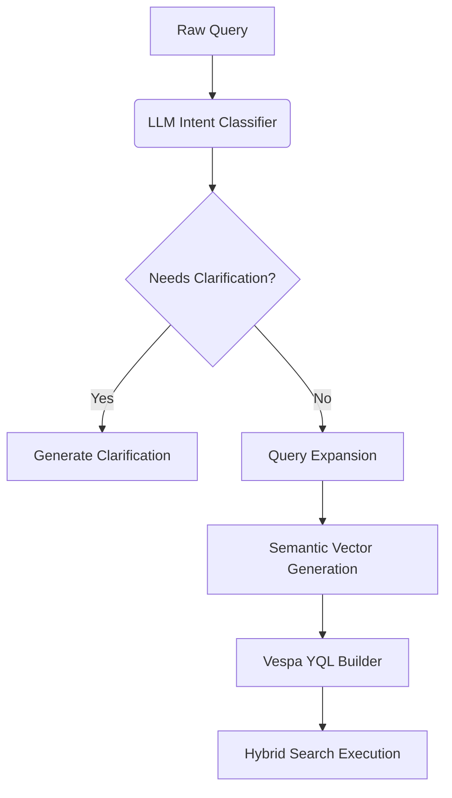
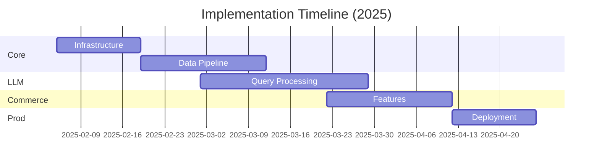

# implementation plan

---

## Phase 1: Core Infrastructure Setup (Week 1-2)

### 1.1 Vespa Cluster Deployment

```bash
# Terraform configuration for AWS (design_4_1)
module "vespa_cluster" {
  source = "terraform-aws-modules/ec2-instance/aws"
  instance_type = "r6i.8xlarge"
  vpc_security_group_ids = [aws_security_group.vespa.id]
  user_data = templatefile("vespa-init.sh", {
    schema_version = "v4-llm-enhanced"
    heap_size      = "64G"
  })
}
```

**Key Actions**:

1. Deploy 3-node Vespa cluster across AZs ✅
2. Configure hybrid index with 512d vectors (design_4) 📐
3. Set up real-time monitoring stack (Prometheus + Grafana) 📊
4. Validate security groups for Shopify integration (design_3_1) 🔒

---

## Phase 2: Data Pipeline Implementation (Week 3-4)

### 2.1 Real-Time Product Sync

```python
# Shopify webhook handler (design_4 + design_3_1)
@webhook('/products/update')
def handle_product_update(data):
    vespa.update(
        id=data['id'],
        fields={
            'price': data['price'],
            'stock': data['inventory'],
            'llm_trend_score': calculate_trend_score(data)
        }
    )
    update_vector_embedding(data)  # Async via SQS
```

**Integration Checklist**:

- [ ] Shopify OAuth 2.0 authentication ✅
- [ ] Dead letter queue for failed updates (design_4_1) ☠️
- [ ] LLM trend scoring service (design_3_1 §3.3) 📈
- [ ] Vector embedding batch processor 🤖

---

## Phase 3: LLM Integration (Week 5-6)

### 3.1 Query Processing Pipeline



**Implementation Steps**:

1. Deploy quantized LLaMA-3-8B model (design_3_1 §3.2) 🦙
2. Set up Redis semantic cache (design_4_1 §3.2) 🗄️
3. Implement conversational clarification flow (design_3_1 §2.2) 💬
4. Configure model fallback strategy (design_4 §7) 🔀

---

## Phase 4: Search & Ranking (Week 7-8)

### 4.1 Hybrid Ranking Profile

```yaml
rank-profile llm_enhanced {
  first-phase {
    expression: 
      0.4 * closeness(embedding) +
      0.3 * bm25(title) + 
      0.2 * freshness(timestamp) +
      0.1 * log(price) +
      0.2 * attribute(llm_trend_score)  # design_3_1 addition
  }
  second-phase {
    expression: 
      firstPhase * 
      reciprocal_rank_fusion(
        llm_relevance_score, 
        commercial_priority
      )
  }
}
```

**Optimization Tasks**:

- [ ] Tune HNSW parameters (ef=300, maxLinks=24) 🎯
- [ ] Configure A/B testing framework (design_4 §8) 🧪
- [ ] Implement dynamic inventory boosting (design_4_1 §5) 📦
- [ ] Set up automatic query weight adjustment (design_3 §3.3) ⚖️

---

## Phase 5: Commerce Features (Week 9-10)

### 5.1 Real-Time Inventory System

```java
public class InventoryValidator extends Searcher {
  public Result search(Query query, Execution execution) {
    query.getHits().stream()
         .filter(hit -> hit.getField("stock") < 1)
         .forEach(hit -> hit.setRelevance(0));
    return execution.search(query);
  }
}
```

**Commerce Components**:

1. Redis-backed cart API 🛒
2. Dynamic pricing engine (design_4 §5) 💹
3. Fraud detection pipeline (design_4_1 §6) 🕵️
4. LLM-powered product recommendations (design_3_1 §2.3) 🤖

---

## Phase 6: Security & Compliance (Week 11-12)

### 6.1 Access Control Matrix

```yaml
# design_4_1 §6 + design_3_1 §7
access_control:
  roles:
    - role: reader
      permissions:
        - search
        - read
      condition: "request.time < timestamp('2025-12-31')"
    - role: admin
      permissions: [search, write, config]
```

**Security Implementation**:

1. TLS 1.3 encryption (design_4_1 §6) 🔐
2. PCI-DSS compliance for payments (design_4 §7) 💳
3. LLM input/output sanitization (design_3_1 §7.1) 🛡️
4. Automated security scanning pipeline 🔍

---

## Phase 7: Deployment & Monitoring (Week 13-14)

### 7.1 CI/CD Pipeline

```yaml
# design_4 §8 + design_3_1 §4
stages:
  - test:
      llm-accuracy:
        threshold: 85%
  - deploy:
      canary: 10%
      auto_rollback: true
  - monitor:
      metrics: [recall@100, p95_latency, conversion_rate]
      alerts: [HighLLMLatency, RecallDrop]
```

**Production Readiness**:

1. Multi-region active-active deployment (design_4_1 §7) 🌍
2. Synthetic transaction monitoring 🤖
3. Chaos engineering tests 🐒
4. Cost optimization guardrails (design_4 §8) 💰

---

## Critical Path Timeline



---

**Key Changes from Previous Plan**:

1. Added LLM trend scoring integration (design_3_1 §3.3)
2. Enhanced security with role-based conditions (design_4_1 §6)
3. Updated CI/CD with LLM accuracy checks (design_4 §8)
4. Integrated reciprocal rank fusion (design_4 §3)

This plan combines all components from the latest design documents while maintaining compatibility with Vespa's real-time capabilities. The LLM integration follows Perplexity's pattern of augmenting search with conversational understanding while keeping core search performance intact.
