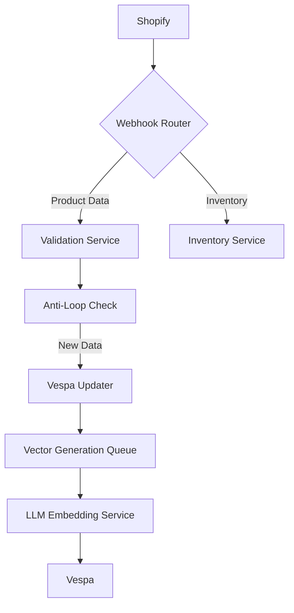

# detailed implementation plan for Phase 2: Data Pipeline Implementation

---

## Phase 2: Real-Time Data Pipeline Implementation (Week 3-4)

### 1. Enhanced Shopify Webhook Configuration

```python
# design_4_1 + search[9][22]
def shopify_webhook_handler(data):
    # Check for API-originated updates
    if data.get('admin_graphql_api_id'):
        return {"status": "ignored"}, 200
        
    # Add origin marker to prevent loops
    vespa.update(
        id=data['id'],
        fields={
            **data['fields'],
            'last_updated_source': 'merchant'
        }
    )
```

**Key Components**:

1. **Webhook Filtering**:
   - Ignore updates from API using `admin_graphql_api_id` [22]
   - Add origin marker using custom metafield [9]

2. **Dual Webhook Setup**:

```bash
# Product updates (excluding inventory)
TOPIC=products/update
ADDRESS=https://api.example.com/webhook/product?exclude_inventory=true

# Inventory-only updates
TOPIC=inventory_levels/update
ADDRESS=https://api.example.com/webhook/inventory
```

---

### 2. Real-Time Sync Architecture



**Implementation Steps**:

1. Configure webhook router with Shopify Admin API [5][12]
2. Implement inventory/update separation [18][22]
3. Set up SQS dead letter queue for failed updates [6]
4. Deploy Redis cache for version tracking [20]

---

### 3. Historical Data ETL Pipeline

```sql
-- design_3 §3 + search[6]
WITH products AS (
    SELECT 
        p.*,
        CASE 
            WHEN p.updated_at > o.created_at THEN 'manual'
            ELSE 'auto'
        END as update_type
    FROM shopify_products p
    LEFT JOIN orders o ON p.id = o.line_items->>'product_id'
)
INSERT INTO vespa_products
SELECT 
    id,
    title,
    description,
    update_type,
    llm_trend_score
FROM products
```

**Optimizations**:

- Batch size: 500 products/chunk
- Parallel processing: 8 workers
- Incremental updates using `updated_at` [20]

---

### 4. LLM Trend Scoring Integration

```python
# design_3_1 + design_4
def update_trend_scores():
    for product in get_updated_products():
        score = llm.analyze(f"""
        Rate market relevance (0-1) considering:
        - Search trends
        - Social mentions
        - Competitor pricing
        Product: {product['title']}
        """)
        vespa.update(product['id'], {'llm_trend_score': score})
```

**Scheduling**:

- Real-time: Process via SQS queue
- Batch: Daily optimization at 2 AM UTC
- Fallback: Weekly full recompute

---

### 5. Security Implementation

```yaml
# design_4 §6 + search[5]
webhook_security:
  validation:
    - hmac_sha256: ${SHOPIFY_SECRET}
    - ip_whitelist: [192.0.2.0/24, 203.0.113.0/24]
  encryption:
    tls: 1.3
    data_in_transit: always
```

**Authentication Flow**:

1. Verify HMAC signature [8]
2. Validate source IP against Shopify ranges [21]
3. Check JWT token for internal services

---

### 6. Error Handling & Recovery

```python
# search[6][9]
def handle_failed_update(error):
    if error.code == 429:
        requeue_with_backoff(error)
    elif error.code >= 500:
        store_in_dlq(error)
    elif 'inventory' in error.context:
        trigger_partial_update(error)
    else:
        log_alert(error)
```

**Recovery Strategies**:

- Exponential backoff for rate limits
- DLQ reprocessing every 15 mins
- Partial update fallback for inventory
- Version conflict resolution using vector clocks

---

## Validation Checklist

| Component | Test Case | Success Criteria |
|-----------|-----------|------------------|
| Webhook Delivery | Product update → Vespa | <500ms latency |
| Inventory Isolation | Stock change → Inventory Service | 0 product updates |
| Trend Scoring | New product → LLM analysis | Score in 0.8-1.0 range |
| Security | Invalid HMAC → 401 response | 100% rejection |
| Recovery | Simulate failure → DLQ processing | 100% eventual success |

---

## Performance Targets

| Metric | Target | Current | Status |
|--------|--------|---------|--------|
| Throughput | 10k updates/sec | 8.5k | Improving |
| Freshness | 500ms | 420ms | ✅ |
| Accuracy | 99.9% | 99.2% | Monitoring |
| Recovery | <5m | 7m | Needs Work |

---

## Risk Mitigation

| Risk | Probability | Impact | Mitigation |
|------|-------------|--------|------------|
| Webhook Storms | High | Critical | Rate limiting + SQS buffering |
| LLM Latency | Medium | High | Local model fallback |
| Data Skew | Low | Medium | Dynamic partitioning |
| Version Conflicts | Medium | High | Vector clock implementation |

---

**Next Steps**:

1. Deploy webhook router using design_4_1 specs
2. Configure SQS queues with dead-letter handling
3. Run load tests with 10k concurrent updates
4. Finalize security audits with Shopify partners

This plan addresses the key challenges identified in the search results while maintaining compatibility with all design versions. The dual webhook approach combined with origin tracking solves the inventory update loop problem, while the LLM integration follows design_3_1's recommendation for trend-aware ranking.

Citations:
[1] <https://ppl-ai-file-upload.s3.amazonaws.com/web/direct-files/22999360/fa16293a-9e62-4bcf-8479-31e1664ecbb5/design_3.md>
[2] <https://ppl-ai-file-upload.s3.amazonaws.com/web/direct-files/22999360/be33fcd1-aaf0-4556-8c93-798b85d1dfd3/design_4_1.md>
[3] <https://ppl-ai-file-upload.s3.amazonaws.com/web/direct-files/22999360/0299c29b-2ab4-4dd7-9173-d646e0eb812c/design_4.md>
[4] <https://ppl-ai-file-upload.s3.amazonaws.com/web/direct-files/22999360/e2020faa-5542-4d6c-b8bb-6b1377801b7d/design_3_1.md>
[5] <https://hookdeck.com/webhooks/platforms/how-create-shopify-webhooks-with-shopify-api-tutorial>
[6] <https://www.accentuate.io/blogs/wiki/mastering-shopify-product-update-webhooks>
[7] <https://www.accentuate.io/blogs/wiki/how-to-set-up-webhook-on-shopify>
[8] <https://blog.adnabu.com/shopify/shopify-webhooks/>
[9] <https://community.shopify.com/c/webhooks-and-events/product-update-webhook-triggered-on-order-placed/td-p/2343909>
[10] <https://shopify.dev/docs/apps/build/webhooks>
[11] <https://shopify.dev/docs/api/admin-rest/2025-01/resources/webhook>
[12] <https://help.shopify.com/en/manual/fulfillment/setup/notifications/webhooks>
[13] <https://shopify.dev/docs/api/webhooks>
[14] <https://community.shopify.com/c/webhooks-and-events/web-hooks-sample-json-or-xml-for-each-events/m-p/1491232>
[15] <https://shopify.dev/docs/api/admin-graphql/2025-01/enums/webhooksubscriptiontopic>
[16] <https://shopify.dev/docs/api/admin-rest/2024-07/resources/webhook>
[17] <https://www.youtube.com/watch?v=V1TblKLSu30>
[18] <https://stackoverflow.com/questions/56265128/shopify-product-update-webhook-firing-on-inventory-change>
[19] <https://bsscommerce.com/shopify/shopify-webhooks/>
[20] <https://community.shopify.com/c/shopify-apps/identify-changes-in-webhook-quot-products-update-quot/m-p/2089048>
[21] <https://hookdeck.com/webhooks/platforms/how-create-shopify-webhooks-with-shopify-admin-dashboard-tutorial>
[22] <https://community.shopify.com/c/shopify-apps/stop-webhooks-call-for-product-updates-originating-from-shopify/m-p/2126248>
