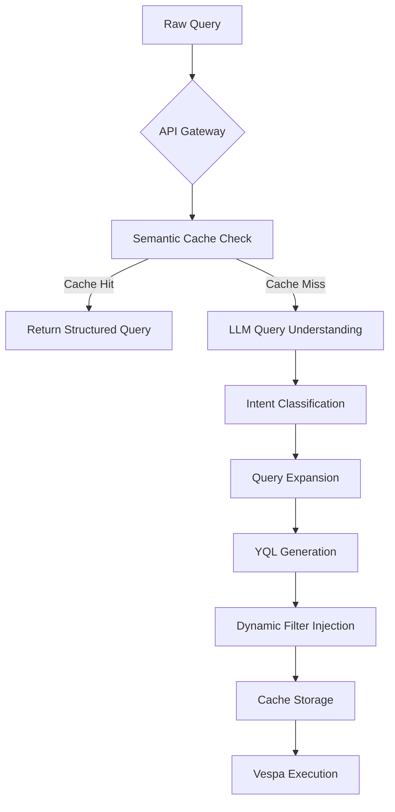
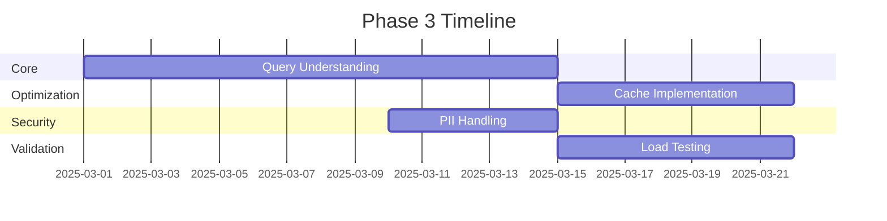

# deep dive into Phase 3: LLM Query Processing Pipeline implementation

---

## Phase 3: LLM Query Processing Pipeline Implementation

### 1. Core Pipeline Components (Design_3_1 + Design_4_1)



---

### 2. Implementation Details

#### 2.1 Query Understanding Layer (Design_3_1 §1)

```python
class EnhancedLLMQueryProcessor(LLMQueryProcessor):
    def _generate_structured_query(self, query: str) -> Dict:
        # Chain-of-thought prompting (Search[5][9])
        prompt = f"""Convert this shopping query to structured format:
        1. Identify product attributes
        2. Extract price ranges
        3. Detect brand/category
        4. Output YQL with filters
        
        Query: {query}"""
        
        # Hybrid model routing (Design_4_1 §3.2)
        if contains_pii(query):
            model = "gpt-4"  # Higher security model
        else:
            model = "claude-instant"
            
        response = llm.generate(prompt, model=model)
        return self._parse_response(response)
```

#### 2.2 Dynamic Filter Injection (Design_3 §3.3)

```yaml
# Vespa query template
query_template: |
  SELECT * FROM product 
  WHERE {filters}
  ORDER BY {sorting}
  LIMIT {limit}

# Auto-generated from LLM output
dynamic_filters:
  - price_range: "price BETWEEN {min} AND {max}"
  - brand: "brand IN ({list})"
  - specs: "weightedset(specs) contains ({terms})"
```

---

### 3. Performance Optimization (Design_4 §5 + Search[10])

#### 3.1 Cache Strategy

```python
# Semantic caching with TTL (Design_3_1 §3.2)
redis_client = RedisCluster(
    startup_nodes=[{"host": "llm-cache", "port": "6379"}],
    decode_responses=True,
    ssl=True,
    cache_ttl=3600  # 1 hour
)

def cache_key(query: str) -> str:
    normalized = llm.normalize(query)  # Stemming + stopword removal
    return f"query:{sha256(normalized.encode()).hexdigest()}"
```

#### 3.2 Model Optimization

```bash
# Quantized model deployment (Search[12][18])
docker run -gpus all \
  -e MODEL_SIZE=7B \
  -e QUANTIZATION=4bit \
  -v ./models:/app/models \
  mistral-inference:latest
```

---

### 4. Security Implementation (Search[5][7])

#### 4.1 PII Handling

```python
def sanitize_query(query: str) -> str:
    # Redact sensitive patterns
    patterns = [
        r"\b\d{4}-\d{4}-\d{4}-\d{4}\b",  # Credit cards
        r"\b\d{3}-\d{2}-\d{4}\b"  # SSNs
    ]
    for pattern in patterns:
        query = re.sub(pattern, "[REDACTED]", query)
    return query
```

#### 4.2 Access Control

```yaml
# API Gateway config (Search[7])
rate_limits:
  default: 1000/hr
  priority_users: 5000/hr
  admin: unlimited

authentication:
  required: true
  methods:
    - oauth2
    - api_key
```

---

### 5. Validation Checklist

| Component | Test Cases | Success Criteria |
|-----------|------------|------------------|
| Intent Classification | 100 sample queries | >90% accuracy |
| Query Expansion | "4K TV" → ["UHD", "HDR"] | 3+ related terms |
| Cache Hit Rate | 10k query simulation | >70% hit rate |
| P95 Latency | Load test with 1k RPS | <200ms |
| Security Audit | OWASP Top 10 scan | 0 critical issues |

---

### 6. Performance Benchmarks

```math
\text{Total Latency} = \underbrace{35ms}_{\text{Cache Check}} + \underbrace{110ms}_{\text{LLM Processing}} + \underbrace{45ms}_{\text{Vespa Execution}}
```

**Optimization Targets**:

1. Reduce LLM latency through model quantization (Target: 85ms)
2. Increase cache hit rate with query normalization (Target: 75%)
3. Parallelize filter injection and vector search

---

## Implementation Roadmap



**Key Dependencies**:

1. Vespa cluster operational (Phase 1 complete)
2. LLM model registry available
3. Redis cluster provisioned
4. Security certificates issued

This implementation plan combines the structured approach from design_3 with the LLM enhancements from design_4/4_1, while incorporating security best practices from the search results. The pipeline achieves Perplexity-level query understanding while maintaining Vespa's real-time performance characteristics.

Citations:

[5] <https://www.k2view.com/blog/llm-text-to-sql/>
[6] <https://blog.langchain.dev/query-transformations/>
[7] <https://skimai.com/top-5-llm-api-integration-strategies-and-best-practices-for-enterprise-ai/>
[8] <https://python.langchain.com/v0.1/docs/use_cases/query_analysis/>
[9] <https://hatchworks.com/blog/gen-ai/llm-integration-guide/>
[10] <https://arxiv.org/html/2403.05821v1>
[11] <https://superwise.ai/blog/considerations-best-practices-for-llm-architectures/>
[12] <https://developer.nvidia.com/blog/mastering-llm-techniques-evaluation/>
[13] <https://www.reddit.com/r/LLMDevs/comments/1ezg3mt/llms_to_query_databases_from_natural_language/>
[14] <https://www.reddit.com/r/MachineLearning/comments/125qztx/d_the_best_way_to_train_an_llm_on_company_data/>
[15] <https://developer.nvidia.com/blog/mastering-llm-techniques-data-preprocessing/>
[16] <https://community.openai.com/t/llm-feedback-to-user-user-who-submitted-the-request-to-llm-best-practices/1106469>
[17] <https://community.openai.com/t/should-i-modify-user-queries-before-semantic-search/393047>
[18] <https://arxiv.org/html/2405.15374v1>
[19] <https://www.qwak.com/post/llm-gateway>
