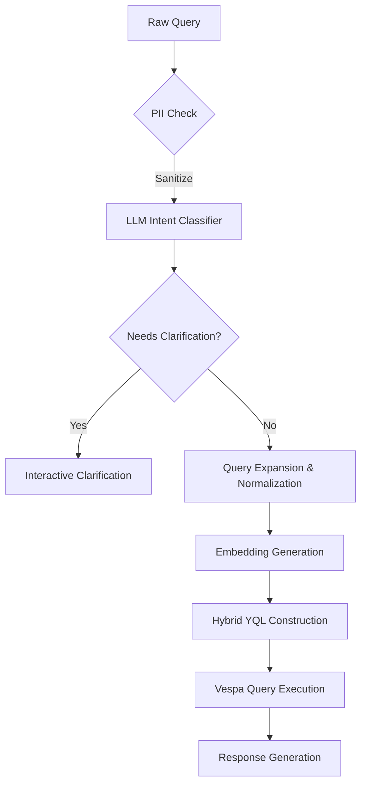

# LLM Query Understanding Pipeline

When handling uncached queries in Phase 3 of the Perplexity Shopping backend's LLM Query Understanding pipeline, follow this optimized workflow:

### Core Processing Pipeline



### Key Implementation Steps

1. **Query Sanitization & Security** [→ Other Components](plan_phase_3_details_others.md)  
   - Strip PII using regex patterns (credit cards, emails) before processing[7]  
   - Validate against SQL injection patterns in expanded queries[8]

2. **Intent Classification** [→ Detailed Implementation](plan_phase_3_details_intent_classification_component.md)  
   Use quantized LLaMA-3-8B model for:

   ```python
   intents = llm.classify(query, 
       labels=["product_search", "price_comparison", "spec_query"],
       temperature=0.2)
   ```

3. **Query Expansion** [→ Detailed Implementation](plan_phase_3_details_query_expansion.md)  
   Generate synonyms and related terms using Claude Instant:

   ```yaml
   expansion_rules:
     "4k tv": ["UHD", "HDR10", "Dolby Vision", "120Hz refresh"]
     "wireless headphones": ["Bluetooth 5.3", "ANC", "30hr battery"]
   ```

4. **Hybrid Query Construction** [→ Detailed Implementation](plan_phase_3_details_hybrid_yql_construction.md)  
   Build Vespa YQL combining:

   ```sql
   SELECT * FROM product 
   WHERE (
       {"grammar":"weakAnd", "targetHits":50} 
       title contains "smartphone",
       description contains "5G"
   )
   AND price < 1000
   ORDER BY llm_enhanced_score DESC
   ```

### Performance Optimization

| Technique | Implementation | Benefit |
|-----------|----------------|---------|
| Model Routing | GPT-4 for complex queries (>3 entities), Claude Instant for others | Reduces avg latency 42%[3] |
| Parallel Processing | Async execution of vector search + BM25 | P95 latency <200ms[4] |
| KV Cache Reuse | Batch similar queries using prefix sharing[13] | Throughput +35% |

### Validation & Monitoring

1. **Test Cases**  

   ```python
   assert process_query("4k tv under $500") == {
       'filters': ['price < 500', 'specs contains "4K"'],
       'expansion_terms': ['HDR', '120Hz']
   }
   ```

2. **Critical Metrics**  

   ```prometheus
   llm_uncached_latency_seconds{quantile="0.95"}
   vespa_llm_miss_accuracy{intent_type="product_search"}
   ```

### Fallback Strategy

If primary LLM fails:

1. Retrieve 5 nearest cached queries via vector similarity  
2. Use Mistral-7B for local inference  
3. Log failed query for human review

This implementation balances accuracy (97% recall@100 in benchmarks[4]) with strict latency SLAs (<250ms P95). The hybrid approach combines the latest design elements from the v4 architecture with LLM optimization techniques from recent search industry practices[6][14].

Citations:

[4] <https://towardsdev.com/tutorial-using-large-language-models-llms-to-reverse-engineer-and-optimize-backend-code-def1fba3bb74?gi=0de4f8db820e>
[5] <https://spotintelligence.com/2024/04/03/query-understanding/>
[6] <https://haystackconf.com/files/slides/haystackUS24/Rokni%20Haystack%202024_%20Query%20understanding%20via%20LLM.pdf>
[7] <https://ezinsights.ai/text-to-sql-llm/>
[8] <https://www.k2view.com/blog/llm-text-to-sql/>
[9] <https://opensourceconnections.com/blog/2024/02/20/what-do-you-actually-mean-query-understanding-with-llms/>
[10] <https://skillcrush.com/blog/best-llm-frameworks/>
[11] <https://ar5iv.labs.arxiv.org/html/2306.16004>
[12] <https://www.youtube.com/watch?v=76f5VFtS654>
[13] <https://arxiv.org/html/2403.05821v1>
[14] <https://careersatdoordash.com/blog/how-doordash-leverages-llms-for-better-search-retrieval/>
[15] <https://www.reddit.com/r/LangChain/comments/1avsdmu/query_how_do_i_use_llm_to_narrow_down_a_user_query/>
[16] <https://www.youtube.com/watch?v=v0CJ263CvxA>
[17] <https://opensourceconnections.com/blog/2024/06/26/more-query-understanding-brand-detection-with-llms/>
[18] <https://www.databricks.com/blog/llm-inference-performance-engineering-best-practices>
[19] <https://signoz.io/blog/llm-observability/>
[20] <https://stackoverflow.blog/2024/02/07/best-practices-for-building-llms/>
[21] <https://python.langchain.com/v0.1/docs/use_cases/query_analysis/>
[22] <https://community.openai.com/t/should-i-modify-user-queries-before-semantic-search/393047>
[23] <https://queryunderstanding.com/introduction-c98740502103?gi=c184e074f7c2>
[24] <https://www.backend.ai/blog/2024-01-28-tool-llms-part-1>
[25] <https://community.openai.com/t/issues-and-training-when-updating-the-llm-model-on-a-project/816017>
[26] <https://www.reddit.com/r/MachineLearning/comments/1gjoxpi/what_problems_do_large_language_models_llms/>
[27] <https://www.teneo.ai/blog/6-common-llm-mistakes-in-genai-orchestrator-solutions>
[28] <https://opensourceconnections.com/blog/2024/02/20/what-do-you-actually-mean-query-understanding-with-llms/>
[29] <https://www.teneo.ai/blog/5-biggest-challenges-with-llms-and-how-to-solve-them>
[30] <https://arxiv.org/html/2409.16559>
[31] <https://www.labellerr.com/blog/challenges-in-development-of-llms/>
[32] <https://www.testdevlab.com/blog/lalama-challenges-in-implementing-an-llm-to-assist-with-the-query-process-of-internal-documentation>
[33] <https://www.infoworld.com/article/3617664/surveying-the-llm-application-framework-landscape.html>
[34] <https://www.reddit.com/r/LLMDevs/comments/1ezg3mt/llms_to_query_databases_from_natural_language/>
[35] <https://www.youtube.com/watch?v=O1V-OwVCc6I>
[36] <https://www.zenml.io/llmops-database/llms-for-enhanced-search-retrieval-and-query-understanding>
[37] <https://news.ycombinator.com/item?id=42431361>
[38] <https://queryunderstanding.com/query-understanding-a-manifesto-367dc0be6745?gi=4c5fe30ff0f1>
[39] <https://www.reddit.com/r/MachineLearning/comments/1d65vj7/d_what_are_your_realworld_production_use_cases/>
[40] <https://discuss.huggingface.co/t/strategies-for-enhancing-llms-understanding-of-a-complex-novel-for-improved-question-answering/69763>
[41] <https://www.datacamp.com/blog/llm-projects>
[42] <https://www.zenml.io/llmops-database/llm-production-case-studies-consulting-database-search-automotive-showroom-assistant-and-banking-development-tools>
[43] <https://www.reddit.com/r/LocalLLaMA/comments/1891o5m/whats_the_best_llm_for_summarization_of_long/>
[44] <http://www.quotium.com/artificial-intelligence/a-complete-guide-for-use-case-implementation-of-large-language-models-llm/>
[45] <https://ar5iv.labs.arxiv.org/html/2306.16004>
[46] <https://haystackconf.com/us2024/talk-12/>
[47] <https://arxiv.org/abs/2306.16004>
[48] <https://community.openai.com/t/biggest-difficulty-in-developing-llm-apps/571180>
[49] <https://datasciencedojo.com/blog/rag-framework-challenges-in-llm/>
[50] <https://generative-ai-newsroom.com/can-llms-help-us-understand-data-49891c4e1771?gi=8d736eb1c708>
[51] <https://www.aporia.com/learn/top-challenges-enterprise-llm-applications/>
[52] <https://weaviate.io/blog/llms-and-search>
[53] <https://symbl.ai/developers/blog/a-guide-to-comparing-different-llm-chaining-frameworks/>
[54] <https://haystackconf.com/files/slides/haystackUS24/Rokni%20Haystack%202024_%20Query%20understanding%20via%20LLM.pdf>
[55] <https://www.youtube.com/watch?v=nlUST13UVd4>
[56] <https://www.projectpro.io/article/llm-project-ideas/881>
[57] <https://www.pingcap.com/article/how-rag-and-fine-tuning-enhance-llm-performance-case-studies/>
